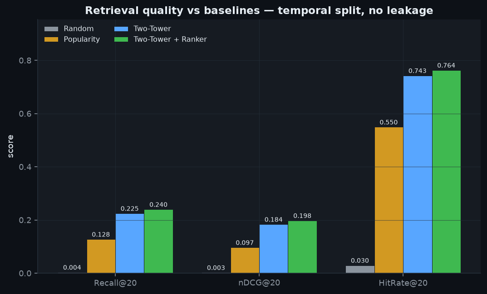
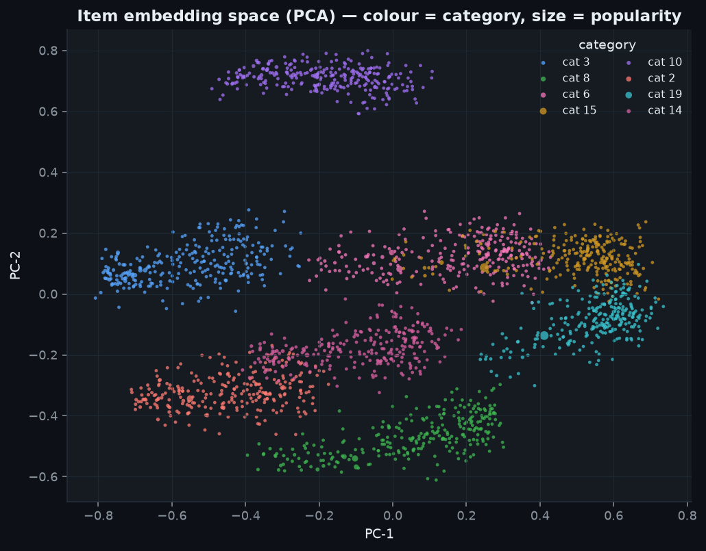
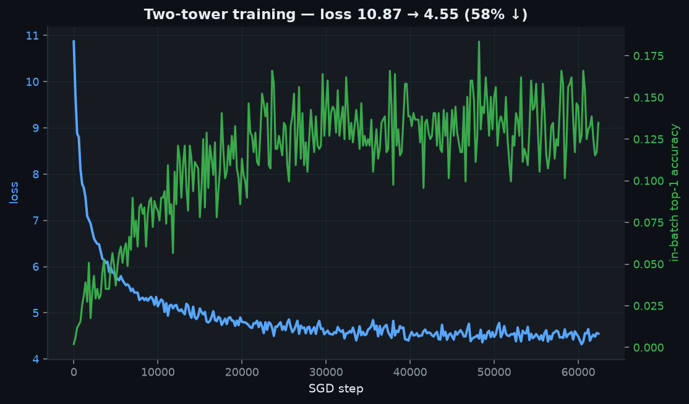
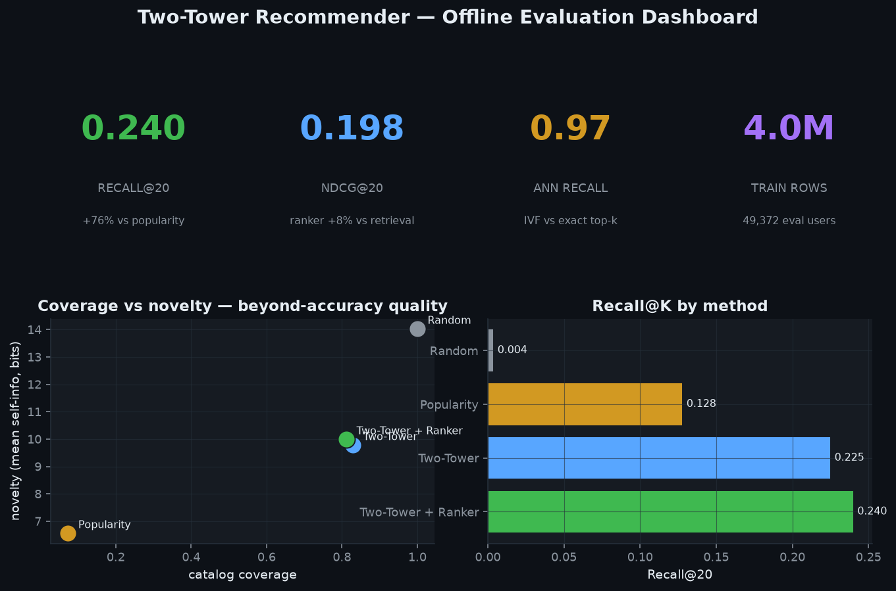

# Two-Tower Recommender — retrieval + ranking at scale

A complete, **offline, deterministic** recommender system: a from-scratch
two-tower retrieval model, ANN candidate generation, a gradient-boosted ranker,
and a leak-free temporal evaluation harness — trained on **millions of implicit
interactions** and architected for **1B**. No GPU, no network, no paid APIs.

```
interaction log ─► temporal split ─► Two-Tower (NumPy, in-batch softmax)
                                        │  user + item embeddings
                                        ▼
                                   ANN (IVF) top-C  ─►  GBM ranker top-K  ─►  eval vs baselines
```

## Why it's interesting

- **Two-tower trained from scratch in NumPy** — in-batch sampled softmax with a
  logQ popularity correction, analytic gradients, plain SGD. The loss provably
  decreases and the item space recovers category structure (both asserted in
  tests). No deep-learning framework.
- **Real two-stage architecture** — ANN retrieval optimised for recall, then a
  `HistGradientBoosting` ranker optimised for nDCG over embedding + popularity +
  recency features. The ranker measurably lifts nDCG over retrieval-only.
- **Honest, leak-free evaluation** — a *temporal* split (train on the past,
  score the future), every statistic computed train-only, seen items excluded.
  Recall@K, nDCG@K, HitRate, coverage and novelty vs popularity + random.
- **Streaming to 1B** — the generator and aggregation path are chunked with
  bounded memory; peak RSS stays flat from 1M to 100M rows.

## Quickstart

```bash
make run          # stream 5M interactions, train two-tower + ranker, evaluate
make screenshots  # render the PNGs in assets/ from that run
make test         # behavioural pytest suite
make bench        # streaming-scale benchmark (bounded memory, up to 100M+ rows)
```

`make run ROWS=20000000` trains on a larger sample. Everything is seeded.

## Results

| method | recall@20 | nDCG@20 | hit-rate | coverage | novelty (bits) |
|--------|----------:|--------:|---------:|---------:|---------------:|
| random | 0.004 | 0.003 | 0.030 | 1.000 | 14.03 |
| popularity | 0.128 | 0.097 | 0.550 | 0.073 | 6.56 |
| **two-tower** (retrieval) | 0.225 | 0.184 | 0.743 | 0.829 | 9.78 |
| **two-tower + ranker** | **0.240** | **0.198** | **0.764** | 0.812 | 9.99 |

*Temporal split (last 20% of the horizon is the future test window), K=20.
Novelty is mean self-information `−log₂ p(item)` in bits; higher = less popular.*

Headline (from the committed run):

- **Two-tower retrieval beats the popularity baseline by +76% recall@20** (0.225 vs
  0.128) and **+90% nDCG** (0.184 vs 0.097) — it captures each user's category
  affinity, which a global popularity ranking structurally cannot.
- **The GBM ranker lifts the shortlist a further +7.8% nDCG / +6.7% recall** →
  final **recall@20 0.240, nDCG@20 0.198, hit-rate 0.764**.
- Trained on **4M interactions** (5M streamed, leak-free temporal split), **49,372**
  eval users, 5,000-item catalogue. ANN (IVF) candidate recall@20 **0.967**;
  two-tower softmax loss **10.87 → 4.55**; coverage **0.81** (personalised, not
  head-only). End-to-end wall time **336 s**, bounded memory.

> Engineering note: two bugs were caught and fixed under review. (1) Without a
> **logQ correction**, in-batch softmax over-penalised popular items and the towers
> learned to *avoid* them — losing to popularity. (2) The ranker sampled negatives
> **popularity-proportionally**, teaching it that popularity is anti-predictive, so
> it inverted a good shortlist below even the popularity baseline; **uniform
> negatives** fixed it and the ranker now genuinely lifts nDCG. Both are classic
> two-tower/two-stage failure modes — see `ARCHITECTURE.md`.

## Project Document

- Research report: [`PROJECT_DOCUMENT.pdf`](./PROJECT_DOCUMENT.pdf)

## Screenshots

All four are generated by `scripts/make_screenshots.py` from the real run
artifacts in `data/results.npz` — no mock-ups.

### Retrieval quality vs baselines


### Item embedding space (PCA), coloured by category


### Two-tower training curve


### Offline evaluation dashboard


## Streaming-scale benchmark

`benchmarks/benchmark_scale.py` consumes the event stream in fixed chunks,
keeping only bounded histograms, so **peak memory is independent of row count**.

<!-- SCALE_TABLE -->

See [ARCHITECTURE.md](ARCHITECTURE.md) for the full path to 1B interactions /
100M items (DuckDB out-of-core features, embedding sharding, IVF-PQ ANN serving).

## Layout

```
src/twotower/
  data.py      streaming implicit-feedback generator (Zipf, affinity, drift)
  model.py     two-tower trainer — in-batch softmax + logQ, NumPy SGD
  ann.py       BruteForce + IVF nearest-neighbour indexes
  ranker.py    gradient-boosted candidate ranker + features
  evaluate.py  temporal split, leak checks, metrics, baselines
  pipeline.py  end-to-end wiring
scripts/       generate_data.py · run.py · make_screenshots.py
benchmarks/    benchmark_scale.py + result CSVs
tests/         behavioural pytest suite (loss ↓, no leakage, beats baselines, ranker ↑ nDCG)
```

## Design notes

- **Seeded end-to-end** — same inputs, same embeddings, same metrics.
- **Bounded memory** — training holds index arrays + one mini-batch of
  embeddings; the generator never materialises the full log.
- **Auditable maths** — the two-tower gradient is hand-derived in `model.py`.

See [ARCHITECTURE.md](ARCHITECTURE.md) for trade-offs and scaling.
